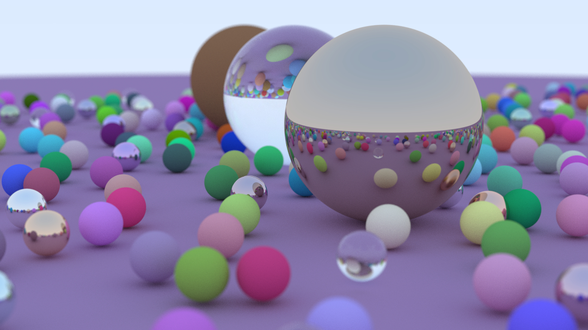

# Raytracing
This project is a Rust implementation of the [Raytracing in one Weekend][1] series by 
Peter Shirley.

The main goal was to familiarize myself with Rust and learn about the design choices behind
the language, so the code might not be very organized or "idiomatic". There is also a lot of
space for performance optimizations.

The tutorial itself is exceptional and I highly recommend it to anyone interested in graphics
programming.

## Final Render

[1]: https://raytracing.github.io/books/RayTracingInOneWeekend.html